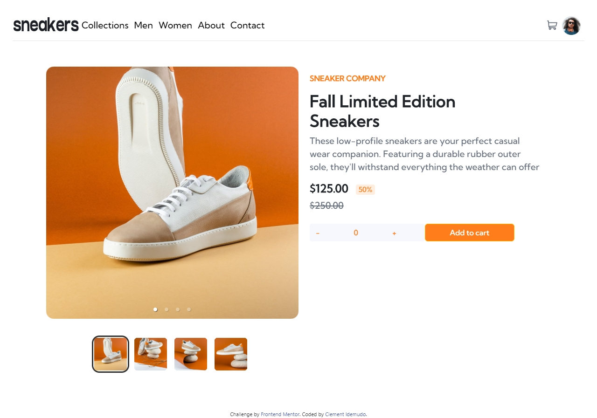
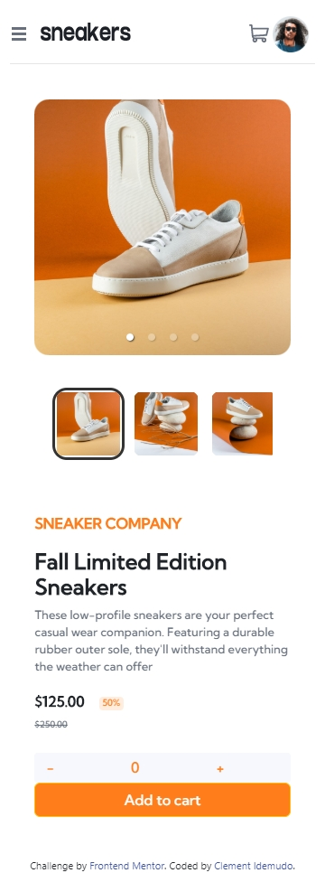

# Frontend Mentor - E-commerce product page solution

This is a solution to the [E-commerce product page challenge on Frontend Mentor](https://www.frontendmentor.io/challenges/ecommerce-product-page-UPsZ9MJp6). Frontend Mentor challenges help you improve your coding skills by building realistic projects.

## Table of contents

- [Overview](#overview)
  - [The challenge](#the-challenge)
  - [Screenshot](#screenshot)
  - [Links](#links)
- [My process](#my-process)
  - [Built with](#built-with)
  - [What I learned](#what-i-learned)
  - [Continued development](#continued-development)
- [Author](#author)
- [Acknowledgments](#acknowledgments)

**Note: Delete this note and update the table of contents based on what sections you keep.**

## Overview

### The challenge

Users should be able to:

- View the optimal layout for the site depending on their device's screen size
- See hover states for all interactive elements on the page
- Open a lightbox gallery by clicking on the large product image
- Switch the large product image by clicking on the small thumbnail images
- Add items to the cart
- View the cart and remove items from it

### Screenshot








### Links

- Solution URL: [Add solution URL here](https://your-solution-url.com)
- Live Site URL: [Add live site URL here](https://your-live-site-url.com)

## My process

### Built with

- Semantic HTML5 markup
- CSS custom properties
- Flexbox
- CSS Grid
- Mobile-first workflow
- [React](https://reactjs.org/) - JS library
- [Styled Components](https://styled-components.com/) - For styles

**Note: These are just examples. Delete this note and replace the list above with your own choices**

### What I learned
Learnt how to use context api. 

created a context api jsx file and exported it


```js
import React, { createContext, useContext, useState } from "react";

const CartContext = createContext();
const ToggleContext = createContext();

function UseCartToggle({ children }) {
  // toggle for cart
  const [show, setShow] = useState(false);
  return (
    <CartContext.Provider value={show}>
      <ToggleContext.Provider value={setShow}>
        <div>{children}</div>
      </ToggleContext.Provider>
    </CartContext.Provider>
  );
}

export { UseCartToggle, CartContext, ToggleContext };
```

imported the custom created context api and used in app component

```js
<UseCartToggle>
      <Nav cartItems={cartItems} emptyCart={emptyCart}></Nav>
      <Hero
        increaseCart={increaseCart}
        decreaseCart={decreaseCart}
        emptyCart={emptyCart}
        cartItems={cartItems}
      ></Hero>
      {/* <Loading></Loading> */}
    </UseCartToggle>
```

If you want more help with writing markdown, we'd recommend checking out [The Markdown Guide](https://www.markdownguide.org/) to learn more.

**Note: Delete this note and the content within this section and replace with your own learnings.**

### Continued development

** How to implement css modal in react**
** How to add media queries on react internal style object**
** How to add window event listener in react**

## Author

- Linkedin - [Clement Idemud](https://www.linkedin.com/in/clement-clement-idemudo)


## Acknowledgments

I acknowledge the grace of God that abounded throughout the period of this project. Being able to code in a constrained environment where power (electricity)dampens your coding-time by a great and noticeable factor.
In all we'ev become better!
I also want to acknowledge sir Whyte of smartHub for his technical supports
